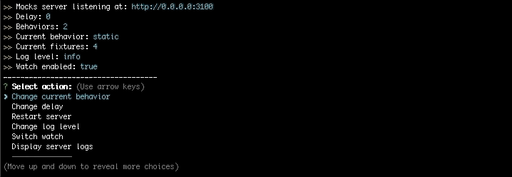

[![Build status][travisci-image]][travisci-url] [![Coverage Status][coveralls-image]][coveralls-url] [![Quality Gate][quality-gate-image]][quality-gate-url]

[![NPM dependencies][npm-dependencies-image]][npm-dependencies-url] [![Last commit][last-commit-image]][last-commit-url] [![Last release][release-image]][release-url] 

[![NPM downloads][npm-downloads-image]][npm-downloads-url] [![License][license-image]][license-url]

# Mocks Server

Mocks server with extensible fixtures groupables in predefined behaviors. Behavior can be changed using built-in CLI or REST API.

## Table of contents

- [Getting started](#getting-started)
- [Installation](#installation)
- [Usage](#usage)
	- [Interactive CLI](#interactive-cli)
  - [Rest Api](#rest-api)
	- [Programmatic usage](#programmatic-usage)
		- [CLI](#cli)
		- [Server](#server)
	- [Global usage](#global-usage)
- [Options](#Options)
- [Defining mocks](#defining-mocks)

## Getting Started

This package provides a server that simulates API behaviors. As input, it needs "fixtures", which are responses for specific uris, and "behaviors", which are sets of "fixtures".

It also provide a built-in CLI and a REST API which allows to change the currently used "behavior" in any moment simply making an http request.

## Installation

```bash
npm i @mocks-server/main --save-dev
```

## Usage

### Interactive CLI

Add an script to your `package.json` file, including the path to your mocks folder:

```json
"scripts": {
  "mocks-server" : "mocks-server --behaviors=./mocks"
}
```

Now, you can start the mocks server CLI simply typing:

```bash
npm run mocks-server
```



## Options

* port `<Number>` Por number for the Server to be listening.
* host `<String>` Host for the server. Default is "0.0.0.0" (Listen to any local host).
* log `<String>` Logs level. Can be one of "silly", "debug", "verbose", "info", "warn", "error".
* watch `<Boolean>` Watch behaviors folder, and restart server on changes. Default is `true`.
* behavior `<String>` Selected behavior when server is started.
* delay `<Number` Responses delay time in milliseconds.
* behaviors `Path as <String>` Path to a folder containing behaviors to be used by the server.
* recursive `<Boolean>` Load behaviors recursively. Watch is not affected by this option, it is always recursive.
* cli `<Boolean>` Start interactive CLI. Default is `true`.

## Defining mocks

The Mocks server handles two main concepts for defining mocks:

### Behaviors

Each behavior consists in a set of "fixtures", which are server responses for specific uris.

Behaviors are extensibles, so, you can have a "base" behavior, which defines the standard behavior of the mocks server and responses for all api uris, and change this behavior creating new behaviors that changes only responses for certain "uris". All extended behaviors are extensible as well.

For creating a Behavior, you have to use the mocks-server "Behavior" class, providing an array of "fixtures" to it:

```js
// Behaviors file 1

const { Behavior } = require("@mocks-server/main");

const fixtures = require("./fixtures");

const myBehavior = new Behavior([fixtures.uri_1_fixture, fixtures.uri_2_fixture]);

module.exports = {
  myBehavior
};
```

Now, when loaded, the server will have available a "myBehavior" behavior, which contains two fixtures. You can add more behaviors extending the first one and changing only the response for "uri_2", for example:

```js
// Behaviors file 2

const { myBehavior } = require("./behaviors");

const fixtures = require("./fixtures");

const myBehavior2 = myBehavior.extend([fixtures.uri_2_different_fixture]);

module.exports = {
  myBehavior2
};
```

Now, server will have available "myBehavior" and "myBehavior2" behaviors. And "myBehavior2" will send a different response only for "uri_2" (supossing that "uri_2_fixture" and "uri_2_different_fixture" were defined with the same uri)

### Fixtures

A "fixture" defines the response for an specific uri. It has to be an object containing properties:

* url `uri as <String>` Uri of the resource. It can contains expressions for matching dynamic uris. Read the [route-parser](https://www.npmjs.com/package/route-parser) documentation for further info about how to use dynamic routing.
* method `<String>` Method of the request. Defines to which method will response this fixture. Valid values are http request methods, such as "GET", "POST", "PUT", etc.
* response `<Object>` Defines the response that the Mocks Server will send to the request:
  * status `<Number>` Status code to send.
  * body `<Object>` Json object to send as body in the response.
* response `<Function>` Response can be defined as a function too. The function will receive the [express](http://expressjs.com/es/api.html) `request`, `response` and `next` arguments, so you are free to handle the server request as you need.

```js
// Fixtures file

const uri_1_fixture = {
  url: "/api/foo-uri",
  method: "GET",
  response: {
    status: 200,
    body: [
      {
        name: "foo-name"
      }
    ]
  }
};

const uri_2_fixture = {
  url: "/api/foo-uri-2/:id",
  method: "PUT",
  response: {
    status: 204
  }
};

const uri_2_different_fixture = {
  url: "/api/foo-uri-2/:id",
  method: "PUT",
  response: (req, res) => {
    res.status(404);
    res.send({
      message: `${req.params.id} was not found`
    });
  }
};

module.exports = {
  uri_1_fixture,
  uri_2_fixture,
  uri_2_different_fixture
};
```

### REST API

The server includes a REST API that allows to change dinamically the current behavior, change delay time, etc.

Available api resources are:

* `GET` `/mocks/behaviors` Returns an array containing all available behaviors.
* `GET` `/mocks/behaviors/current` Returns current behavior.
* `PUT` `/mocks/behaviors/current` Set current behavior.
  * Request body example: `{ "name": "behavior-name" }`
* `GET` `/mocks/settings` Return current server settings.
  * Response body example: `{ "delay": 0 }`
* `PUT` `/mocks/settings` Change current server settings.
  * Request body example: `{ "delay": 3000 }`

### Programmatic usage

#### Server

The server can be instantiated and started programmatically:

```js
const { Server } = require("@mocks-server/main");

const startMyServer = () => {
  const server = new Server(path.resolve(__dirname, "mocks"), {
    port: 3200,
    log: "debug",
    watch: false
  });

  return server.start();
};

startMyServer().then(server => {
  console.log("Server started", server);
});
```

##### `Server` (behaviorsFolder \[,options\])

First argument is mandatory, and has to be a path to a folder containing "behaviors" and "fixtures". All files in the folder will be loaded recursively, including subfolders.
For second argument options, please read the [options](#options) chapter of this documentation.

Available methods of an instance are:

- `start` (). Starts the server.
- `stop` (). Stops the server.
- `restart` (). Stops the server, initializes it again (reloading behaviors files), and starts it again.
- `switchWatch` (state `<Boolean>`). Enable or disable behaviors files watch, depending of the received "state" value.

Available getters are:

- `behaviors`. Returns loaded behaviors object.
- `watchEnabled`. Current state of the behaviors files watcher.
- `error`. When server has returned an error, or an error ocurred loading behaviors, it is available in this property.
- `events`. Returns server events object. A "watch-reload" event is emitted when the server watch detects changes in any behaviors or fixtures file, and restarts the server.

> The interactive CLI can be started programatically too. Read the [cli advanced docs](./docs/cli.md) for further info.

### Global usage

The mocks server can be used as a global dependency as well:

```bash
npm i @mocks-server/main -g
```

Now, you can start the built-in command line interface from anywhere, providing a path to a folder containing behaviors:

```bash
mocks-server --behaviors=./path-to-behaviors
```

### Support (OS Terminals)

@mocks-server/main uses [inquirer][inquirer-url] for displaying CLI. You can [consult his OS Terminals support here][inquirer-support].

## Contributing

Contributors are welcome.
Please read the [contributing guidelines](.github/CONTRIBUTING.md) and [code of conduct](.github/CODE_OF_CONDUCT.md).

[inquirer-url]: https://www.npmjs.com/package/inquirer#support-os-terminals
[inquirer-support]: https://www.npmjs.com/package/inquirer#support-os-terminals

[coveralls-image]: https://coveralls.io/repos/github/mocks-server/main/badge.svg
[coveralls-url]: https://coveralls.io/github/mocks-server/main
[travisci-image]: https://travis-ci.com/mocks-server/main.svg?branch=master
[travisci-url]: https://travis-ci.com/mocks-server/main
[last-commit-image]: https://img.shields.io/github/last-commit/mocks-server/main.svg
[last-commit-url]: https://github.com/mocks-server/main/commits
[license-image]: https://img.shields.io/npm/l/@mocks-server/main.svg
[license-url]: https://github.com/mocks-server/main/blob/master/LICENSE
[npm-downloads-image]: https://img.shields.io/npm/dm/@mocks-server/main.svg
[npm-downloads-url]: https://www.npmjs.com/package/@mocks-server/main
[npm-dependencies-image]: https://img.shields.io/david/mocks-server/main.svg
[npm-dependencies-url]: https://david-dm.org/mocks-server/main
[quality-gate-image]: https://sonarcloud.io/api/project_badges/measure?project=mocks-server-main&metric=alert_status
[quality-gate-url]: https://sonarcloud.io/dashboard?id=mocks-server-main
[release-image]: https://img.shields.io/github/release-date/mocks-server/main.svg
[release-url]: https://github.com/mocks-server/main/releases
